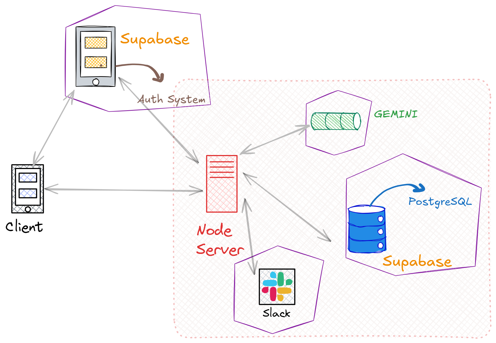

# Todo Summary Assistant

  
Problem Statement and Requirements

  
  ## Objective
  Build a fully functional full-stack application where a user can:
  - Create and manage personal to-do items.
  - Click a button to summarize all pending to-dos using an actual LLM (e.g., OpenAI, Anthropic, Cohere, Mistral, Gemini, etc.).
  - Send the generated summary to a Slack channel.

  ## Requirements

  ### Frontend
  - Use React to build the UI.
  - **Functionality:**
      - Add, edit, delete to-do items.
      - View list of current to-dos.
      - A button to generate and send the summary.
      - Show a success/failure message for the Slack operation.

  ### Backend
  - Use Node.js (Express).
  - The backend should expose the following endpoints:
      - `GET /todos` – Fetch all todos.
      - `POST /todos` – Add a new todo.
      - `DELETE /todos/:id` – Delete a todo.
      - `POST /summarize` – Summarize todos and send to Slack.

  ### LLM Integration
  - Integrate with a real LLM API (like OpenAI, Cohere, Gemini, or similar with free-tier access).
  - Use the LLM to summarize the to-do list meaningfully — don’t simulate or mock this.

  ### Slack Integration
  - Use Slack Incoming Webhooks to post the summary to a Slack channel.
  - Include instructions for how to configure this in your README.

  ### Hosting & Database
  - Use Supabase for backend/database hosting.
  - You may use a free-tier PostgreSQL/Supabase DB to store the to-dos.

  ## Stack Flexibility
  You are free to choose your own stack and tools (within the boundaries above) as long as:
  - You use React for the frontend.
  - The backend is built in Node.js.
  - You integrate with a real LLM API and Slack.
  - The core functionality and flow are implemented as described.

## Design and Architecture Decisions

The application is designed as a decoupled full-stack application with a React frontend and a Node.js (Express) backend.

### Architecture Overview:
-   **Frontend**: The React-based frontend is the primary interface for users. It handles user interactions, such as creating, viewing, editing, and deleting to-do items.
    -   **Authentication**: The frontend integrates with Supabase Authentication to manage user sign-up, sign-in, and session management.
    -   **API Interaction**: It communicates with the backend via RESTful APIs to perform CRUD operations on to-dos and to trigger the summarization process.
-   **Backend**: The Node.js (Express) backend serves as the application's core logic and data management layer.
    -   **API Endpoints**: It exposes REST APIs for the frontend to consume.
    -   **Authorization**: For protected routes, the backend verifies the JWT token (obtained from Supabase Auth) sent by the frontend to ensure the user is authenticated and authorized.
    -   **Database Interaction**: The backend interacts with a PostgreSQL database hosted on Supabase to store and retrieve to-do items.
    -   **LLM Integration**: It integrates with the Gemini API to generate summaries of pending to-do items.
    -   **Slack Integration**: It uses Slack Incoming Webhooks to send the generated summaries to a pre-configured Slack channel.

### Design Rationale:
-   **Loose Coupling**: Separating the frontend and backend allows for independent development, scaling, and deployment.
-   **Modularity & Reusability**: The architecture promotes a modular design. For instance, the authentication service (Supabase Auth) is a distinct module, and the database interaction is handled by a dedicated service layer in the backend.
-   **Avoiding Vendor Lock-in**: While Supabase is used for authentication and database services, the core application logic is designed to be relatively independent. This allows for easier migration to different service providers or self-hosted solutions if needed in the future. For example, the database interaction can be abstracted further to support other SQL databases, and authentication logic can be adapted for other OAuth providers.
-   **Clear Separation of Concerns**: The frontend is responsible for presentation and user interaction, while the backend handles business logic, data processing, and third-party integrations.

## Setup Instructions for local run

For detailed setup and execution instructions, please navigate to the respective directories:

-   **Frontend:** [./frontend/README.md](./frontend/README.md)
-   **Backend:** [./backend/README.md](./backend/README.md)

## Live Preview

You can access a live preview of the application here: [https://todo-summary-assistant-frontend.onrender.com/](https://todo-summary-assistant-frontend.onrender.com/)

**Note:** Since the application is hosted on a free platform, it might take a minute or two for the initial content to load. Please be patient.

---

To learn more about the frontend or backend, or to run them, please navigate to their respective directories:

-   **Frontend:** [./frontend/README.md](./frontend/README.md)
-   **Backend:** [./backend/README.md](./backend/README.md)

